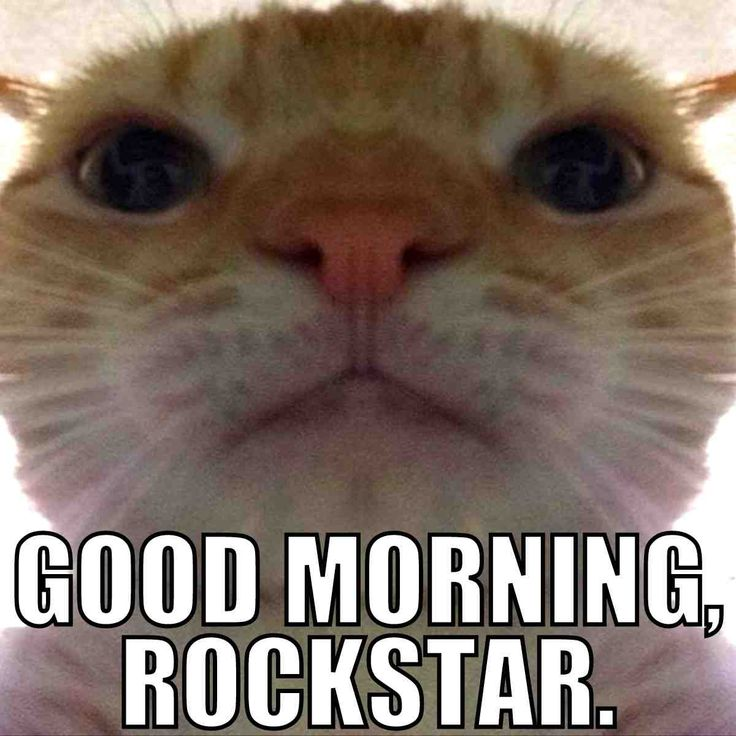

 
<h3 align="center">README Template</h3>

Source for my awesome personal README template.

<h2></h2>

 

## Description
Lorem ipsum dolor sit amet, consectetur adipiscing elit. Aliquam sed augue fermentum, hendrerit nibh at, aliquam mi. Integer iaculis nisl in erat gravida iaculis. Pellentesque habitant morbi tristique senectus et netus et malesuada fames ac turpis egestas. Mauris lorem libero, tristique sit amet massa quis, cursus luctus ante. Class aptent taciti sociosqu ad litora torquent per conubia nostra, per inceptos himenaeos. Suspendisse in consequat diam. Pellentesque ultrices et felis egestas tincidunt. In congue arcu eros, eu varius mi semper vel. Fusce lobortis porttitor mi et molestie. Duis quis ultrices sem. Aenean diam lacus, facilisis eu pellentesque finibus, pulvinar id magna.

## Contributions
Contributions are always welcome!  
Just make a [pull request](../../pulls).

## Licence
MIT license
